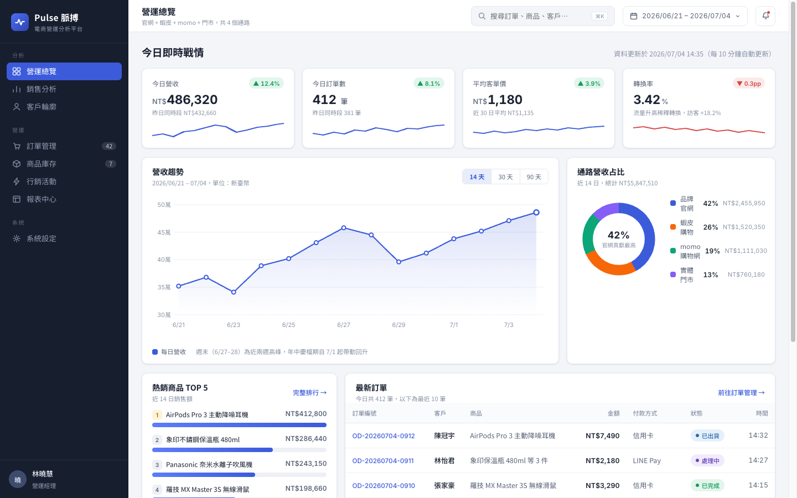
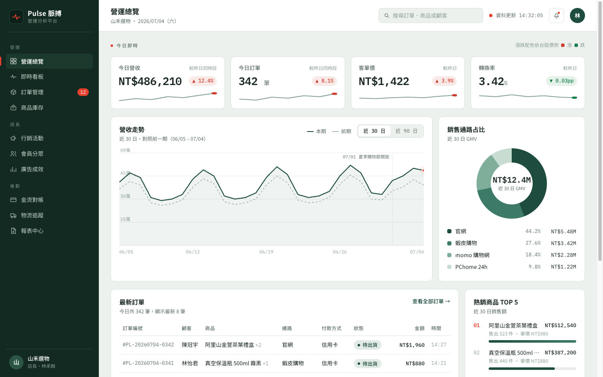
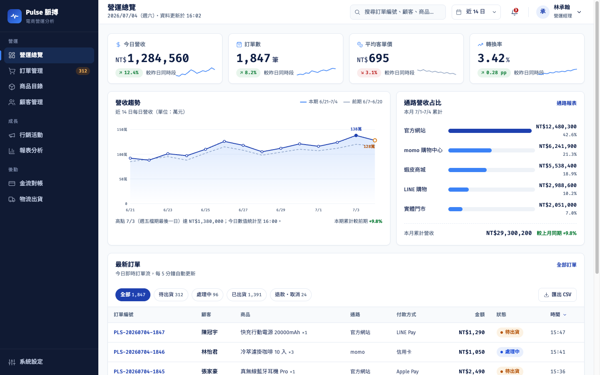
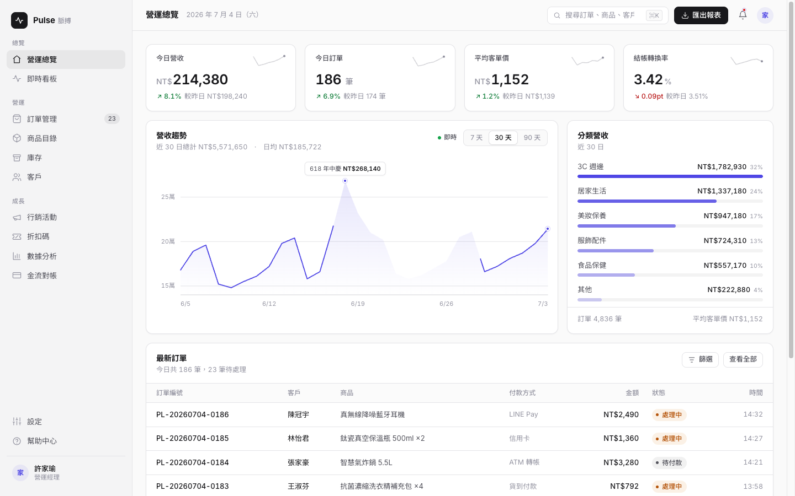
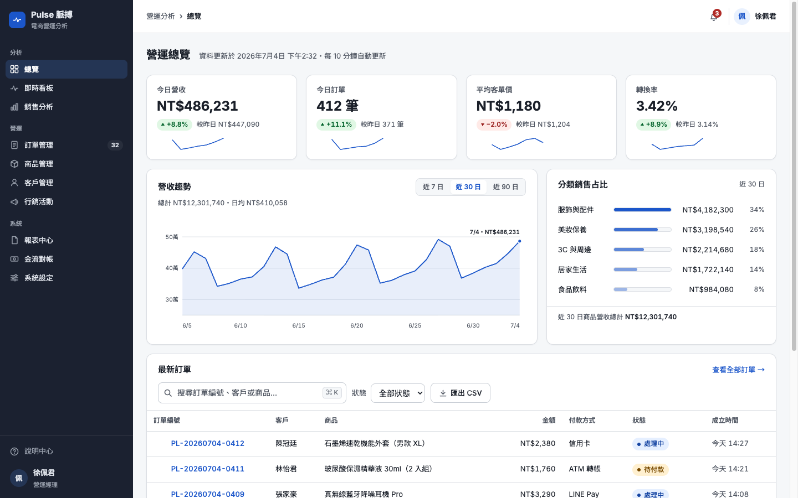
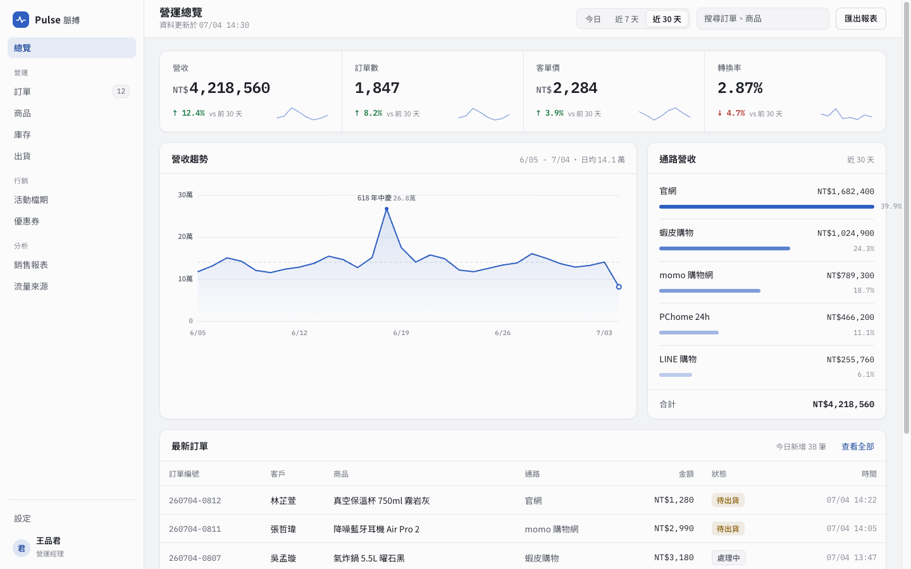
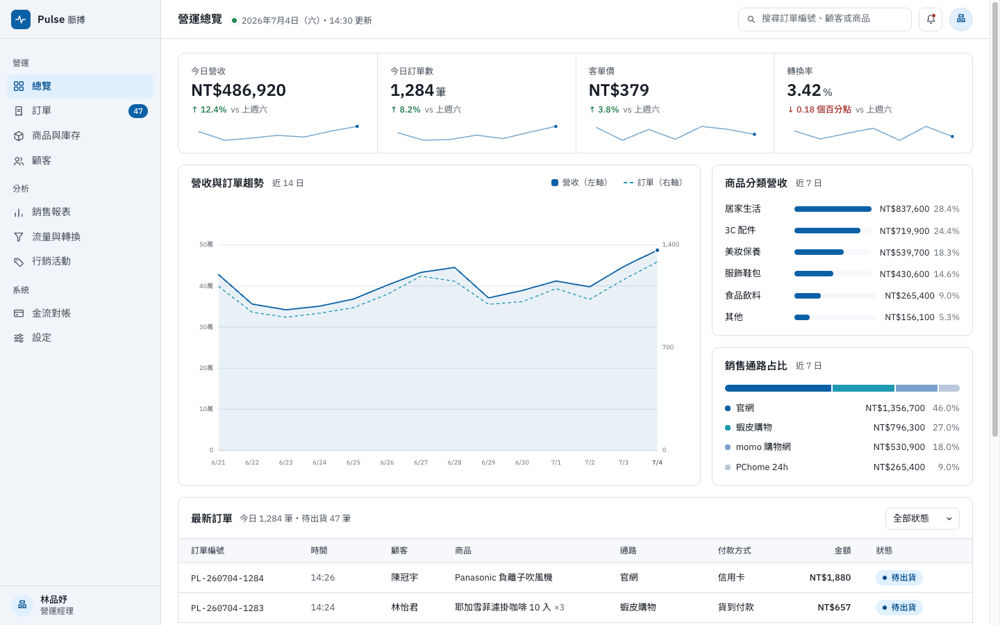

# designcompare — Design Skill 對決：同一份提示詞 × 七種設計 DNA

靈感來自 [@vista8 的推文](https://x.com/vista8/status/2073100197769646511)：他測了最流行的 5 個前端頁面設計 Skill（完整測評見 [designskill.qiaomu.ai](https://designskill.qiaomu.ai/)）。本專案重現其中「任務 B · 數據儀表盤」：安裝同一批 skills，用完全相同的提示詞與限制，讓每個 skill 各自獨立生成一個頁面，外加無 Skill 對照組與評論區點名的 [impeccable](https://impeccable.style/)，共七個網站。

## 任務簡報（六個變體完全相同）

> 為電商營運分析平台「Pulse 脈搏」設計儀表板：側邊欄、頂欄、4 個 KPI 卡、純 CSS/SVG 圖表、訂單表格。
> **考察點：** 資訊密度、資料排版、功能性克制。

硬性限制：單一 HTML 檔案、僅允許 Google Fonts、禁用外部圖片、禁用圖表函式庫（圖表純 CSS/SVG 手刻）、繁體中文（台灣）內容。

## 七個變體

| 變體 | 來源 | 推文評價 |
|------|------|----------|
| `baseline` | 無 Skill 對照組 | — |
| `frontend-design` | Anthropic 官方 | 萬金油，用的人太多，即將成為新的 AI 味 |
| `ui-ux-pro-max` | [ui-ux-pro-max](https://github.com/nextify-limited/ui-ux-pro-max) | 非常一般，自帶太多模板反而限制模型發揮 |
| `emil-design-eng` | [emilkowalski/skills](https://github.com/emilkowalski/skills) | 動效方面最好 |
| `web-design-guidelines` | [vercel-labs/agent-skills](https://github.com/vercel-labs/agent-skills) | 網頁規範＋無障礙最好 |
| `taste-skill` | [Leonxlnx/taste-skill](https://github.com/Leonxlnx/taste-skill) | AI 味最小，文案簡潔 |
| `impeccable` | [pbakaus/impeccable](https://github.com/pbakaus/impeccable) · [impeccable.style](https://impeccable.style/) | 評論區點名補測的熱門 skill |

## Skill 安裝方式

```bash
npx skills add emilkowalski/skills --skill emil-design-eng -g -y
npx skills add vercel-labs/agent-skills --skill web-design-guidelines -g -y
npx skills add Leonxlnx/taste-skill --skill design-taste-frontend -g -y
npx skills add pbakaus/impeccable -g -y
```

（`frontend-design` 來自 Claude Code 官方 plugin；`ui-ux-pro-max` 已安裝於 `~/.claude/skills/`。）

## 成果截圖（1440×900，點圖可看原始 HTML）

| | |
|---|---|
| **baseline** — 無 Skill 對照組<br>[](pages/baseline.html) | **frontend-design** — Anthropic 官方<br>[](pages/frontend-design.html) |
| **ui-ux-pro-max** — 規則庫型<br>[](pages/ui-ux-pro-max.html) | **emil-design-eng** — 動效最佳<br>[](pages/emil-design-eng.html) |
| **web-design-guidelines** — Vercel 規範<br>[](pages/web-design-guidelines.html) | **taste-skill** — AI 味最小<br>[](pages/taste-skill.html) |
| **impeccable** — 設計語彙系統<br>[](pages/impeccable.html) | |

## 本地瀏覽

```bash
python3 -m http.server 8787
# 開啟 http://localhost:8787 — index.html 提供六個變體的切換對比
```

## 專案結構

```
index.html          # 對比首頁（分頁切換六個變體）
pages/
  baseline.html
  frontend-design.html
  ui-ux-pro-max.html
  emil-design-eng.html
  web-design-guidelines.html
  taste-skill.html
  impeccable.html
```

每個變體由獨立的 Claude agent 生成，彼此看不到對方的產出，確保對比公平。
